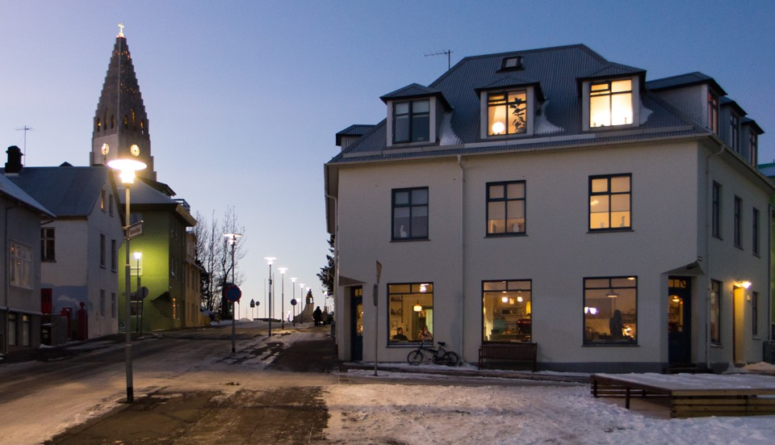
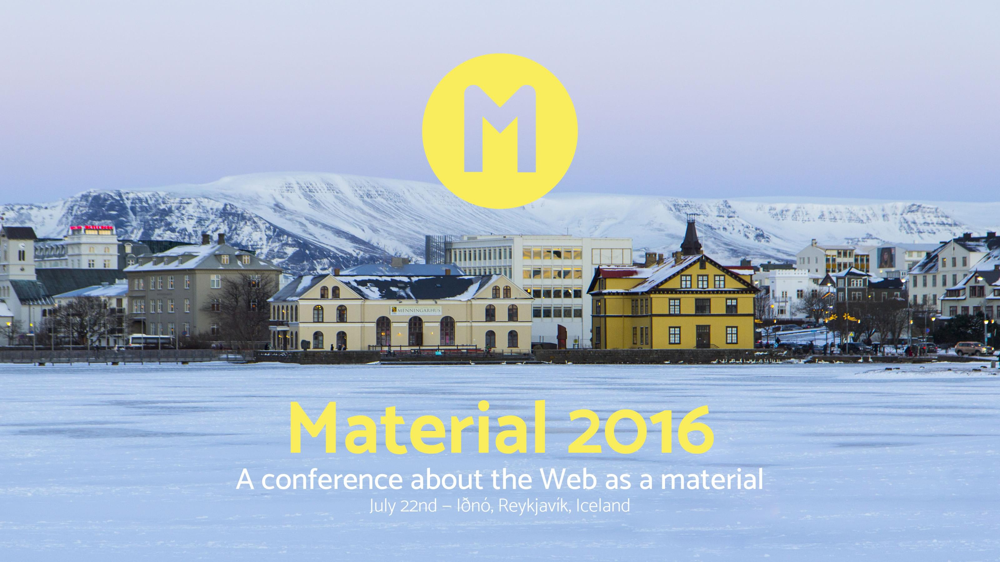

# [Material](https://web.material.is)*
## A conference exploring the concept of the Web as a material

> July 22nd, 2016 — Reykjavík, Iceland

> Reykjavík at Dawn — Copyright © 2016 [Joschi Kuphal](https://jkphl.is)

The Internet and the Web are still very new to us. We don't fully understand them as a material. For centuries we've worked with wood, metal, glass, ceramic, paper, textiles. More recently, new materials have emerged; plastics, fiberglass, silicon, and more. We understand their limitations, their affordances. We can fold, heat, manipulate and warp some of these materials.

**What does this mean for the Web? What are the properties of the Web as a Material?**

We have lost the Apprentice/Master relationship in the digital world. Spending years getting our hands dirty with an expert, learning slowly and really understanding the material rather than the framework. We need to be asking ourselves what sacrifices should we be making for the convinience of our customers rather than shortcuts for ourselves.

**What properties of materialness exists in the Web is what this conference is meant to explore.**

### Speakers

Our first confirmed speaker is [Petro Salema](http://www.petrosalema.com/). He is a designer and programmer whose driving mission is to use technology and design to build tools that enable people to do great things in new and inspiring ways. Most recently, he has been doing that by leading the development of the Aloha Editor project. Based in Vienna, Austria, originally from Tanzania, he will be enlightening us on all things in his life dealing with the Web as a Material. We're excited to hear what he comes up with!

Our second confirmed speaker is [Matt Jones](http://moleitau.com/). Former BERG Principle, now working at Google NYC on various top secret things. He'll be giving us a short presentation and then curating a slot looking at some of the ideas around raw computing. If the Web were a material, he'd brute force his way to the best answer, maybe without even understanding how he got there — and that's OK.

Other speakers haven't been sorted out yet. We'd like to bring a mix of people internationally and Icelandic locals. A few invitations have gone out and we are slowly collecting who's available when.

> The theatre building Iðnó right at the pond — Copyright © 2016 [Joschi Kuphal](https://jkphl.is)

### Venue: Iðnó
For July 22nd, we decided to use Iðnó, short for Iðnaðarmannahúsið. Built in 1896, located in the center of Reykjavík, it is easy to access from various hotels and guesthouses. More importantly, near plenty of great food and shops. Rather than use a full-service hotel or conference center, we are trying a smaller, cozier and definitely more memorable location.

### Field Trip
As something extra, we want to try and organize a small field trip around town meeting with companies who deal with different materials. For example, a Ceramic studio workshop, Leather craft, Letterpress, Aluminium casting, etc. These are to be determined both when, where and what.

### Tickets available NOW!
As of March 9th, tickets are **[available via a Kickstarter campaign](https://www.kickstarter.com/projects/material16/material-conference-2016)** running for 30 days. The regular tickets cost $150 and are limited to 145. There are also rewards for people who can't attend in person and still want to be part of our little adventure.

This is the phase that will decide whether Material 2016 can become reality, so we really need your support now. Please back us with any amount you can, every little bit helps. Also, we'd be very happy if you could help us spreading the word!

> [Join us for some stimulating conversation — Copyright © 2016 [Joschi Kuphal](https://jkphl.is)

### Travel and accomodation
It's a little bit too early to think about travel stuff until the Kickstarter succeeds, but we started putting together a [Foursquare list](https://foursquare.com/jkphl/list/material-2016) with lots of recommendations in downtown Reykjavík, including lodging opportunities. There are also plenty of nice [AirBnbs](https://www.airbnb.de/s/Reykjavík) around town, so please check them out as well. We plan to open up some sort of communication platform soon where you can discuss travel and accommodation sharing possibilities with other attendees. Stay tuned!

We know that travelling to Iceland for a conference might sound like an adventure — and it is! — so please bear with us while we try to get some special deals for you.

## Keep In Touch
[Sign-up for our newsletter](https://material.us12.list-manage.com/subscribe?u=47afb33257f1e65f442e8f176&id=c291cb4ea6) so we can let you know when tickets will be available. This helps us gauge our numbers to find the right cozy venue to meet the demand.

Also, let your friends know that you like what we're doing by [tracking Material on Lanyrd](http://lanyrd.com/2016/material16).

## #Material16
This conference is about understanding materials. The 16th material in the periodic table is Sulfur. If you visit Iceland, you'll understand why that's interesting.

## Who's behind this?
The two organizers are [Joschi Kuphal](https://jkphl.is) and [Brian Suda](http://suda.co.uk). You may [contact us via email](mailto:info@material.is).

[Add Material Conference to your calendar](public/assets/material16.ics)
___

> \* We use *material.is* as a working title at the moment but it might well become the official conference name. This website is in a very early stage and will be constantly improved.
