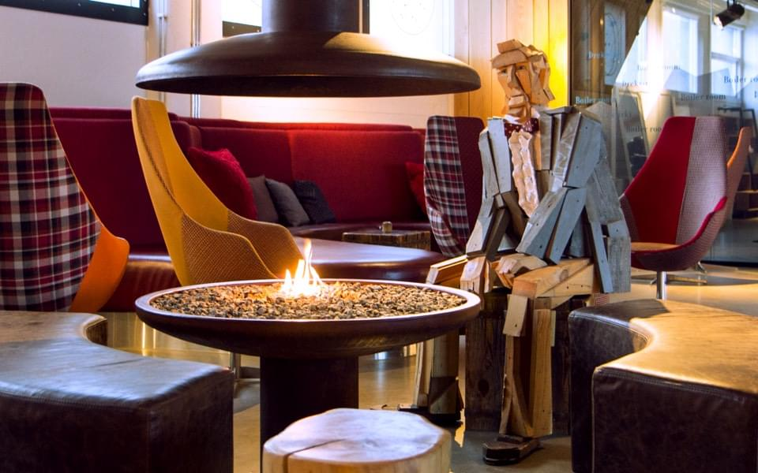

# [Material 2017](https://web.material.is)
## A conference exploring the concept of the Web as a material

> August 17th, 2017 — Reykjavík, Iceland

20+ years of the Web and we are still at the very beginning of **understanding and implementing digitization**.

For the first time we are facing a generation that never got to know **the offline world**. By nature they are riding the wave without ever having touched the ground.

Like we might have unlearned our ancestors' knowledge about materials and crafts, it's easy to overlook the **intrinsic characteristics of the Web** in favour of the newest framework or boilerplate.

### Let's re-explore the material Web and evaluate what we have learned so far. Join us to Iceland for a trip through history, views and cultures.

For centuries we've worked with wood, metal, glass, ceramic, paper, textiles. More recently, new materials have emerged; plastics, fiberglass, silicon, and more. We understand their limitations, their affordances. We can fold, heat, manipulate and warp some of these materials. But the Internet and the Web are still very new to us. We don't fully understand them as a material.

**What does this mean for the Web? What are the properties of the Web as a Material?**

We have lost the Apprentice/Master relationship in the digital world. Spending years getting our hands dirty with an expert, learning slowly and really understanding the material rather than the framework. We need to be asking ourselves what sacrifices should we be making for the convinience of our customers rather than shortcuts for ourselves.

**What properties of materialness exists in the Web is what this conference is meant to explore.**

### Tickets
This is a very small conference, only around 60 attendees. Tickets are available now for $150 (~€140 EUR, £120 GBP). [Tickets are limited. Only $150. Get yours today!](https://ti.to/material-conference/material-2017)

> Join us for some stimulating conversation — Copyright © 2016 [Joschi Kuphal](https://jkphl.is)

### Travel and accomodation
It's a little bit too early to think about travel stuff until the Kickstarter succeeds, but we started putting together a [Foursquare list](https://foursquare.com/jkphl/list/material-2016) with lots of recommendations in downtown Reykjavík, including lodging opportunities. There are also plenty of nice [AirBnbs](https://www.airbnb.com/s/Reykjavík) around town, so please check them out as well. We plan to open up some sort of communication platform soon where you can discuss travel and accommodation sharing possibilities with other attendees. Stay tuned!

We know that travelling to Iceland for a conference might sound like an adventure — and it is! — so please bear with us while we try to get some special deals for you.

## Keep In Touch
[Sign-up for our newsletter](https://material.us12.list-manage.com/subscribe?u=47afb33257f1e65f442e8f176&id=c291cb4ea6) so we can let you know when tickets will be available. This helps us gauge our numbers to find the right cozy venue to meet the demand.

Also, let your friends know that you like what we're doing by [tracking Material on Lanyrd](http://lanyrd.com/2017/material17).

## #Material17
This conference is about understanding materials. The 17th material in the periodic table is Chlorine. If you visit any of Iceland's swimming pools, you'll understand why that's interesting.

## Who's behind this?
The two organizers are [Joschi Kuphal](https://jkphl.is) and [Brian Suda](http://suda.co.uk). You may [contact us via email](mailto:info@material.is).

[Add Material Conference to your calendar](public/assets/material17.ics)
