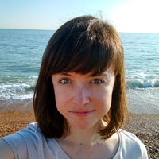
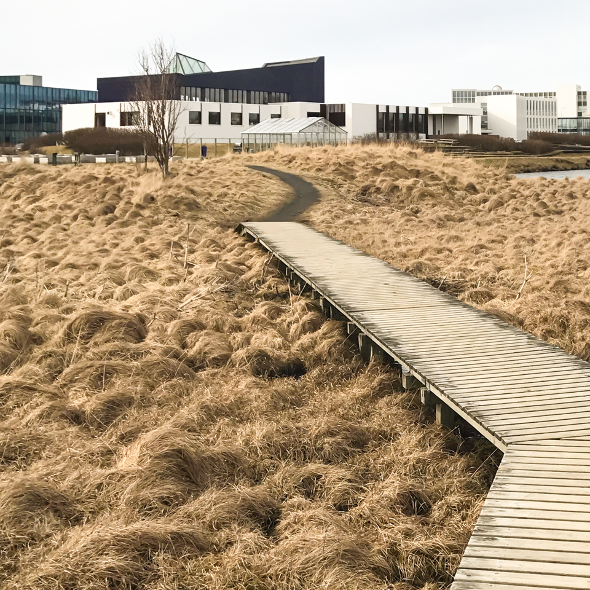

# [Material 2017](https://web.material.is)
## A conference exploring the concept of the Web as a material

> August 17th, 2017 — Reykjavík, Iceland

20+ years of the Web and we are still at the very beginning of **understanding and implementing digitization**.

For the first time we are facing a generation that never got to know **the offline world**. By nature they are riding the wave without ever having touched the ground.

Like we might have unlearned our ancestors' knowledge about materials and crafts, it's easy to overlook the **intrinsic characteristics of the Web** in favour of the newest framework or boilerplate.

### Let's re-explore the material Web and evaluate what we have learned so far. Join us to Iceland for a trip through history, views and cultures.

For centuries we've worked with wood, metal, glass, ceramic, paper, textiles. More recently, new materials have emerged; plastics, fiberglass, silicon, and more. We understand their limitations, their affordances. We can fold, heat, manipulate and warp some of these materials. But the Internet and the Web are still very new to us. We don't fully understand them as a material.

**What does this mean for the Web? What are the properties of the Web as a Material?**

We have lost the Apprentice/Master relationship in the digital world. Spending years getting our hands dirty with an expert, learning slowly and really understanding the material rather than the framework. We need to be asking ourselves what sacrifices should we be making for the convinience of our customers rather than shortcuts for ourselves.

**What properties of materialness exists in the Web is what this conference is meant to explore.**

### Speakers

We'll bring a mix of **5-6 people** internationally and Icelandic locals. A few invitations have gone out and we are slowly collecting who's available when, so stay tuned for updates!

#### Amber Wilson

Our first confirmed speaker is **[Amber Wilson](http://amberwilson.co.uk/)** . Amber is a budding designer continually getting excited about everything to do with the Web whether it's front-end development, server side languages or user experience. Last July she discovered the Web development community in sunny Brighton, UK, and began to build her skills while enjoying getting to know people.

She's had an appreciation and love of both design and science from a really young age and is always seeking to learn more about both. Also fascinated by people, she pursued a Master's degree in Child Psychology and with this can bring a unique perspective on respecting both where we've come from and where we'll go in terms of the Web.

#### Hannah & Justin Floyd

**[Hannah and Justin Floyd](http://www.solidwool.com)** had an idea. What if they could find a new way of working with wool and so perhaps bring something back to their small market town, a once thriving part of the woollen industry?

They learnt that the coarse wool from hill-farmed, upland sheep had dramatically lost its value in recent years. So they started to play. To turn the way wool is worked on it's head. The end result is [Solidwool](http://www.solidwool.com/) — a strong, beautiful and unique composite material. Think fibreglass, but with wool.

They know better than anyone else, literally down to the micron scale about wool. That deep understanding is what we're going to talk about in relation to knowing your material and its affordances.

> Norræna húsið, the Nordic House — Copyright © 2017 [Brian Suda](http://suda.co.uk)

### The Nordic House

For our first pilot conference on August 17th, we decided to use Norræna húsið, the **[Nordic House](http://nordichouse.is/en/)**. Built in 1968 by acclaimed Finnish modernist architect Alvar Aalto, located close to the center of Reykjavík, it is easy to access from various hotels and guesthouses within short walking distance.

The house maintains a library and the Nordic Region in Focus information service. In addition, there is a shop for Nordic design and food products, exhibition space and auditoriums. The house also features an acclaimed restaurant serving New Nordic food — this is where we will have lunch together.

Rather than use a full-service hotel or conference center, we are trying a smaller, cozier and definitely more memorable location.

### Tickets
This is a very small conference, only around 60 attendees. Tickets are available now for $159 (~€150 EUR, £130 GBP). [Tickets are limited. Only $159. Get yours today!](https://ti.to/material-conference/material-2017)

> Join us for some stimulating conversation — Copyright © 2016 [Joschi Kuphal](https://jkphl.is)

### Travel and accomodation
It's a little bit too early to think about travel stuff until the Kickstarter succeeds, but we started putting together a [Foursquare list](https://foursquare.com/jkphl/list/material-2016) with lots of recommendations in downtown Reykjavík, including lodging opportunities. There are also plenty of nice [AirBnbs](https://www.airbnb.com/s/Reykjavík) around town, so please check them out as well. We plan to open up some sort of communication platform soon where you can discuss travel and accommodation sharing possibilities with other attendees. Stay tuned!

We know that travelling to Iceland for a conference might sound like an adventure — and it is! — so please bear with us while we try to get some special deals for you.

## Keep In Touch
[Sign-up for our newsletter](https://material.us12.list-manage.com/subscribe?u=47afb33257f1e65f442e8f176&id=c291cb4ea6) so we can let you know when tickets will be available. This helps us gauge our numbers to find the right cozy venue to meet the demand.

Also, let your friends know that you like what we're doing by [tracking Material on Lanyrd](http://lanyrd.com/2017/material17).

## #Material17
This conference is about understanding materials. The 17th material in the periodic table is Chlorine. If you visit any of Iceland's swimming pools, you'll understand why that's interesting.

## Who's behind this?
The two organizers are [Joschi Kuphal](https://jkphl.is) and [Brian Suda](http://suda.co.uk). You may [contact us via email](mailto:info@material.is).

[Add Material Conference to your calendar](public/assets/material17.ics)
